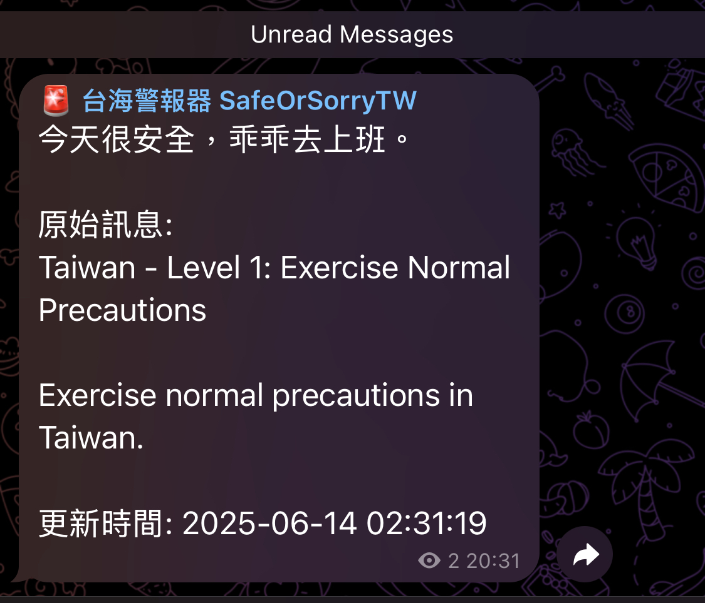
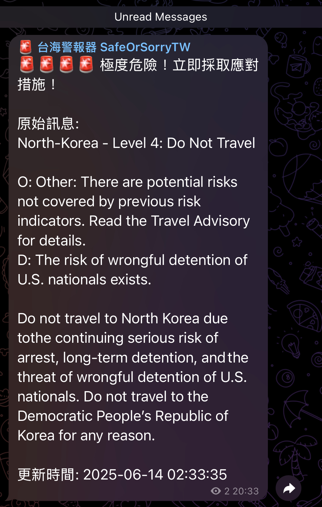
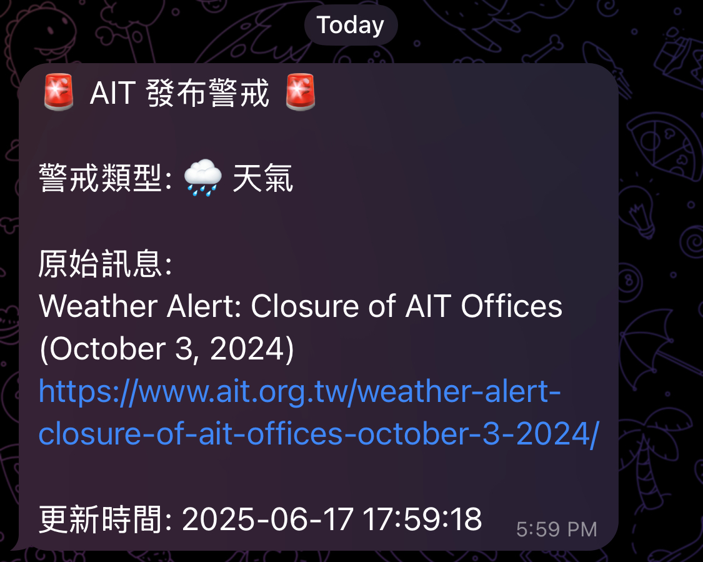

# 台海警報器 SafeOrSorryTW

## 簡介
這是一個監控美國國務院對台灣旅遊警示等級的 Telegram 機器人。

- 每天早上 5:30，它會告訴你今天應該照常去上班，或是...你懂的。
- 每 30 分鐘檢查警示等級，如有變動立即通知。
- 每 30 分鐘檢查 AIT（美國在台協會）發布的警戒訊息，如有新訊息立即通知。

資訊來源：
- [U.S. Department of State - Taiwan Travel Advisory](https://travel.state.gov/content/travel/en/traveladvisories/traveladvisories/taiwan-travel-advisory.html)
- [American Institute in Taiwan(AIT) Alert](https://www.ait.org.tw/category/alert/)

如果你希望支持我繼續完善這個機器人，也歡迎你請我喝一杯[咖啡](https://portaly.cc/ry_001/support)🧎

## 立即加入頻道
[@safeorsorrytw](https://t.me/safeorsorrytw)

## 警示等級說明
美國國務院旅遊警示分為四個等級：

- Level 1: Exercise Normal Precautions（保持正常警戒）
- Level 2: Exercise Increased Caution（提高警覺）
- Level 3: Reconsider Travel（重新考慮是否前往）
- Level 4: Do Not Travel（請勿前往）

>根據慣例，若看到 Level 3, 4，那就是準備要出大事了。

## AIT警戒訊息說明
AIT 會不定期會發佈警戒訊息，從歷史推播來看通常為天氣、地震警戒，而參考烏克蘭案例，撤僑通知亦會在此發布。

## 示範截圖

### 警示等級 - 太平時期

### 警示等級 - 警戒時期（以北韓為例）

### AIT 警戒訊息（以 2024/10/3 颱風為例）

## 授權
MIT License

